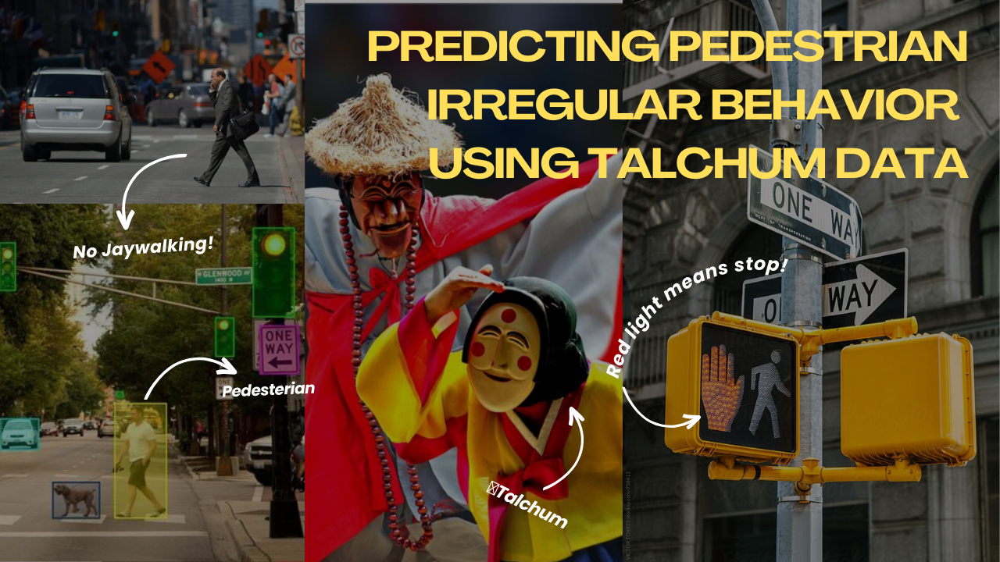

# Predictive Pedestrian Detection in Autonomous Driving Using Traditional Korean Mask Dance (Talchum) Motion Data 🇰🇷🎭🕺


### 📌 Project Overview

Predicting unexpected pedestrian behavior is essential for safe autonomous driving. This project leverages complex motion patterns from **Talchum (traditional Korean mask dance) data to build a model that can predict non-standard pedestrian behavior**
, which is often missed by conventional pedestrian datasets. By combining YOLO with a keypoint-based detection system, this project aims to enable autonomous vehicles to respond more swiftly and accurately to unpredictable pedestrian actions.

### 📂 Directory Structure
```
Autonomous-Pedestrian-Prediction-with-Talchum-Motion-Data/
├── csv_file/
│ │ ├── extracted_talchum_important.csv/
│ │ └── filtered_keypoints.csv/
├── presentation/
│ │ ├── final_presentation.pdf/
│ │ └── final_presentation_eng.pdf/
├── step/
│ │ ├── step0_move_point_analysis.ipynb/
│ │ ├── step1_data_preprocessing.py/
│ │ ├── step2_EDA_correlation.ipynb/
│ │ ├── step3_train_yolo_model.py/
│ │ ├── step3.1_train_yolo_tutorial.ipynb/
│ │ └── step4_prediction_and_results.py/
├── .gitignore/
├── README.md/
├── cover.png/
├── main.py/
└── 빅데이터_김서희.pdf/
```

### 🚀 Key Features

- **Complex Motion Learning:** Learns various movement patterns in Talchum, enhancing the model's ability to detect unusual pedestrian behavior.
- **YOLO & Keypoint-based Risk Detection:** Uses YOLO for pedestrian location detection and keypoints for anticipating sudden movements.

### 📊 Data Processing & Analysis
Key and Keypoint Analysis: Visualizes the relationships between height and keypoints using vector flow and heatmaps to understand movement patterns.
Correlation Analysis: Shows correlations between height and keypoints for deeper insight into pedestrian behaviors.

### 📼 Presentation ([watch here!](https://youtu.be/ZgqAdSvPlhI))
📌 **Presentation Slides** : [📄 Download the PDF](presentation/final_presentation_eng.pdf)



### 🛠️ Tools Used
- **Python**: Core programming language for data processing, model training, and analysis.
- **Google Colab**: Cloud environment for training and experimentation.
- **YOLO (You Only Look Once)**: Primary tool for bounding box-based object detection.
- **OpenCV**: Used for computer vision processing and keypoint analysis.
- **Matplotlib & Seaborn**: Libraries for data visualization, heatmaps, and flow mapping.

### 📄 References

- [Hybrid Camera for Self-Driving Car Safety - EETimes](https://www.eetimes.eu/hybrid-camera-targets-self-driving-car-safety/)
- [Hybrid Camera Technology in Self-Driving - Dong-A Science](https://m.dongascience.com/news.php?idx=65680)
- [AI Hub Talchum Dataset - AI Hub](https://www.aihub.or.kr/aihubdata/data/view.do?currMenu=115&topMenu=100&aihubDataSe=data&dataSetSn=71759)
- [Self-Driving Technology Report - ScienceON](https://scienceon.kisti.re.kr/srch/selectPORSrchReport.do?cn=TRKO202300005284)
- [AIHub Data and Google Colab Usage - Velog](https://velog.io/@guswns7451/%EB%A8%B8%EC%8B%A0%EB%9F%AC%EB%8B%9D-AIHub-%EB%8D%B0%EC%9D%B4%ED%84%B0-%EB%8B%A4%EC%9A%B4-Google-Colab-%EC%82%AC%EC%9A%A9)
- [Predicting Pedestrian Behavior with Hybrid Camera Technology - Yonhap News](https://www.yna.co.kr/view/MYH20211011013700641)
